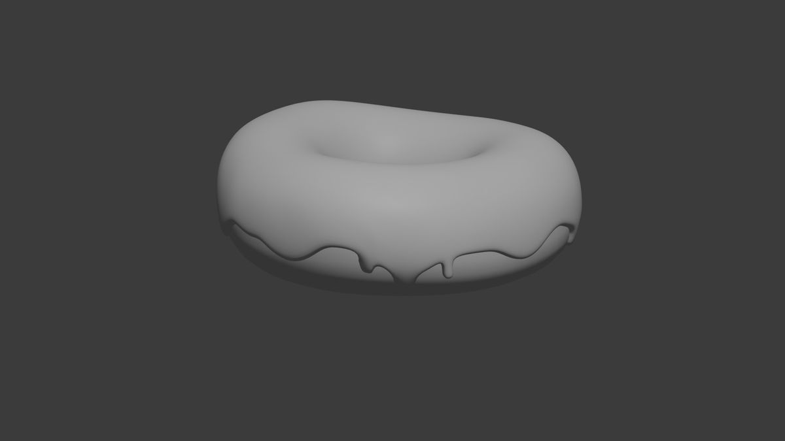

# Parliamo di me

Mi chiamo Valentina e mi sono buttata sul 3D, specialmente Blender.
Questo mondo non è nuovo per me dato che gia ho scolpito e modellato prima in 3D su un altro sito, facile e sicuramente perfetto per chi vuole iniziare/indirizzarsi verso questo mondo. Il sito si chiama  [WOMP](https://beta.womp.com/discover){:target="_blank"}
ed è perfetto per chi ha un computer che non regge le grafiche o chi vuole solo  modellare cose carine per il proprio piacere personale (cio che fai puo anche essere stampato) ma torniamo al dunque, la mia esperienza con Blender.

La primissima cosa che abbia mai provato a fare e stata la tipica [ciambella](https://www.youtube.com/watch?v=B0J27sf9N1Y&list=PLjEaoINr3zgEPv5y--4MKpciLaoQYZB1Z){:target="_blank"}, che è praticamente il tutorial beginner per eccellenza. 
Diciamo che con questo tutorial ho imparato molte scorciatoie e passaggi, ma non sono arrivata molto in là:

{:style="width:300px; height:auto;"}

Principalmente perchè non è quello che mi interessa. Vidi un video che diceva che, anche se difficile, magari di concentrarci su cio che ci interessava creare, perchè l'interesse ci avrebbe reso più facile imparare. Quindi ho abbandonato la ciambella e mi sono concentrata più su qualcosa un po più hard:

{:style="width:300px; height:auto;"}
{:style="width:300px; height:auto;"}

È ancora in fase di modellazione, ma sto adorando come sta venendo, specialmente considerando che è la mia prima testa.
Con questo ho imparato molte scorciatoie e cose utili.
