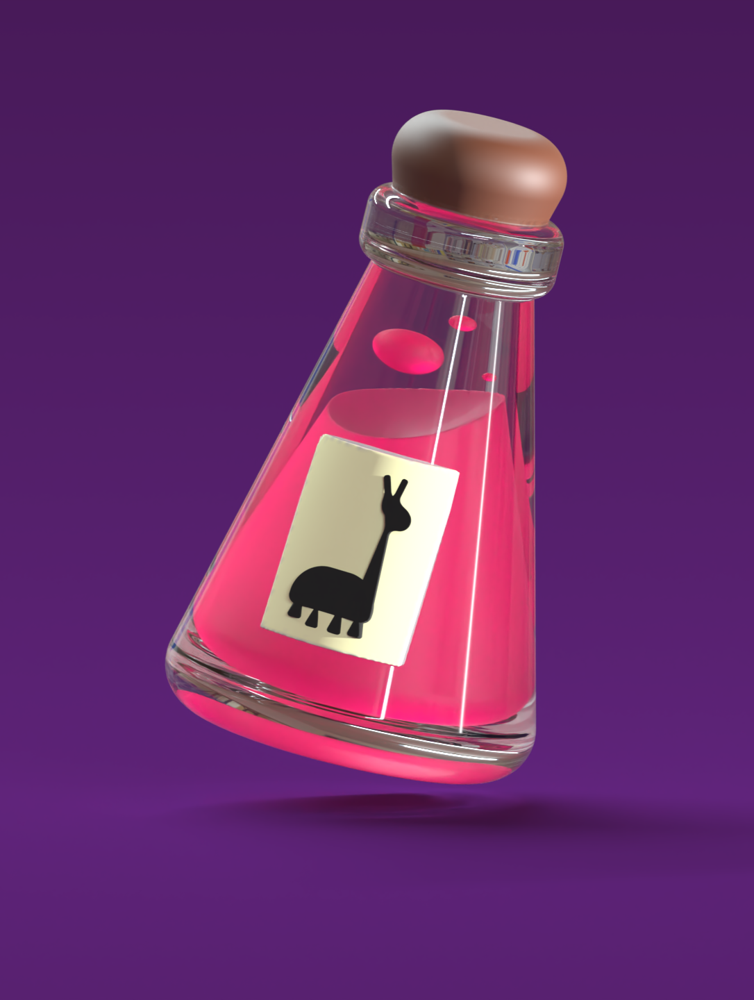
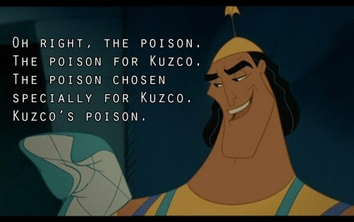
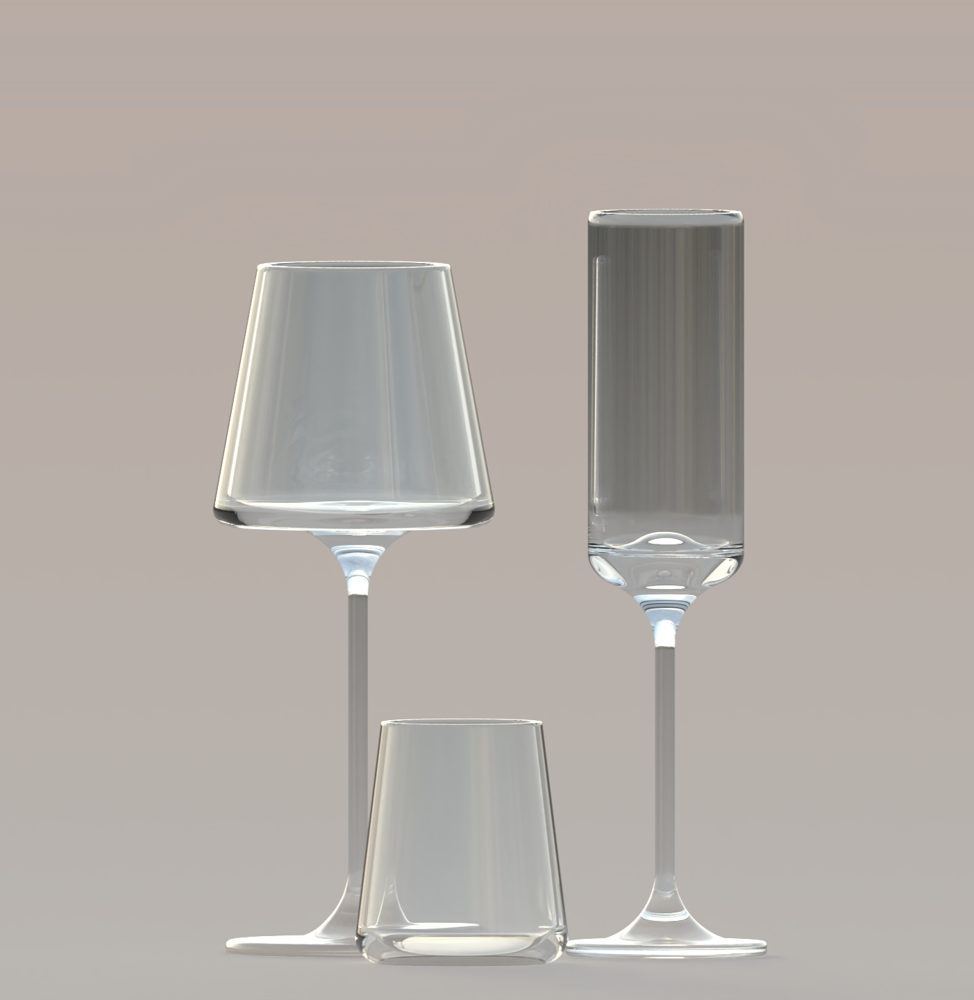

# I MIEI LAVORI IN 3D

Scopri di più:  [WOMP](https://beta.womp.com/discover){:target="_blank"}

Per altri lavori visita il profilo:  [@0k](https://beta.womp.com/profile/e7d37f52-dd31-4ef7-a029-19e518be62e7){:target="_blank"}

{:style="width:300px; height:auto;"}
{:style="width:600px; height:auto;"}

Invece questi sono dei calici di vetro:

{:style="width:300px; height:auto;"}

 e un bicchiere.